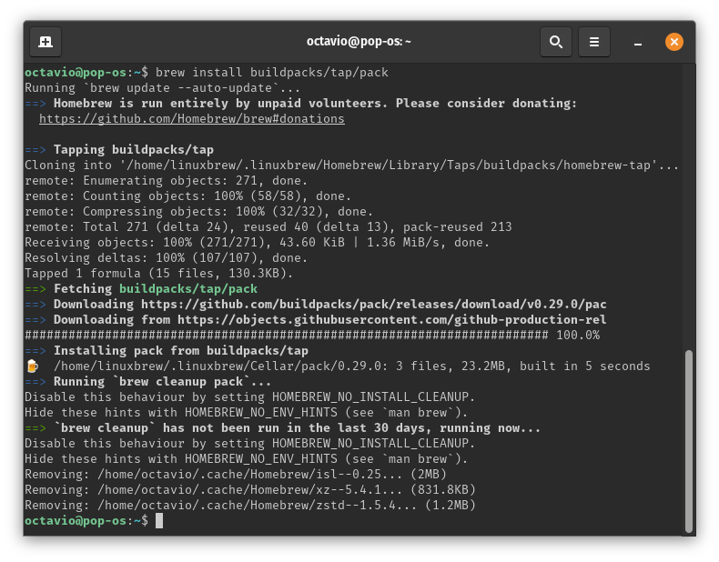
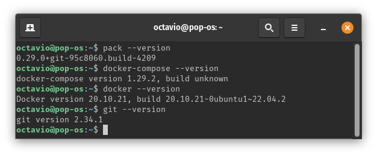

# **SETUP DO AMBIENTE**

Para trabalhar para qualquer empresa será importante que você tenha a sua máquina "preparada" para desenvolver o que for necessário.

Vou detalhar aqui como instalar um setup que atende a estrutura mínima necessária que utilizei para começar a desenvolver para empresas gringas.

Instalaremos os seguintes programas básicos:

- docker

- docker-compose

- pack cli

- git

## **DOCKER / DOCKER-COMPOSE**

Tem um ótimo guia da Digital Ocean neste link que explica o passo a passo para instalar o Docker no Linux: [How To Install and Use Docker on Ubuntu 20.04 | DigitalOcean](https://www.digitalocean.com/community/tutorials/how-to-install-and-use-docker-on-ubuntu-20-04)

Basicamente para o Docker:

```bash
sudo apt update
sudo apt install apt-transport-https ca-certificates curl software-properties-common
curl -fsSL https://download.docker.com/linux/ubuntu/gpg | sudo apt-key add -
sudo add-apt-repository "deb [arch=amd64] https://download.docker.com/linux/ubuntu focal stable"
apt-cache policy docker-ce
sudo apt install docker-ce
sudo systemctl status docker
```

E para o docker-compose, tem um guia similar: [How To Install and Use Docker Compose on Ubuntu 20.04 | DigitalOcean](https://www.digitalocean.com/community/tutorials/how-to-install-and-use-docker-compose-on-ubuntu-20-04)

```bash
sudo curl -L "https://github.com/docker/compose/releases/download/1.29.2/docker-compose-$(uname -s)-$(uname -m)" -o /usr/local/bin/docker-compose
sudo chmod +x /usr/local/bin/docker-compose
docker-compose --version
```

## **GIT**

Se você ainda não tem o Git instalado, as informações para instalação estão aqui: [Git - Instalando o Git](https://git-scm.com/book/pt-br/v2/Começando-Instalando-o-Git)

No Linux é um simples:

```console
sudo apt-get install git-all
```

## **PACK CLI**

Para instalar o pack cli você pode seguir as instruções deste link: [Pack · Cloud Native Buildpacks](https://buildpacks.io/docs/tools/pack/)

No meu caso, como eu tenho o [Homebrew](https://brew.sh) instalado, instalar o pack cli foi feito com um comando simples: 

```bash
brew install buildpacks/tap/pack
```



(Se você não tem o Homebrew, eu fiz uma thread faz um tempo atrás sobre o assunto aqui: https://twitter.com/octavioietsugu/status/1511777362396037133?s=20

Depois que o pack cli for instalado, você pode checar que está tudo no jeito com o comando

```bash
pack --version
```


Com a instalação desses pacotes, temos o básico do nosso setup para começar a trabalhar: 😊


